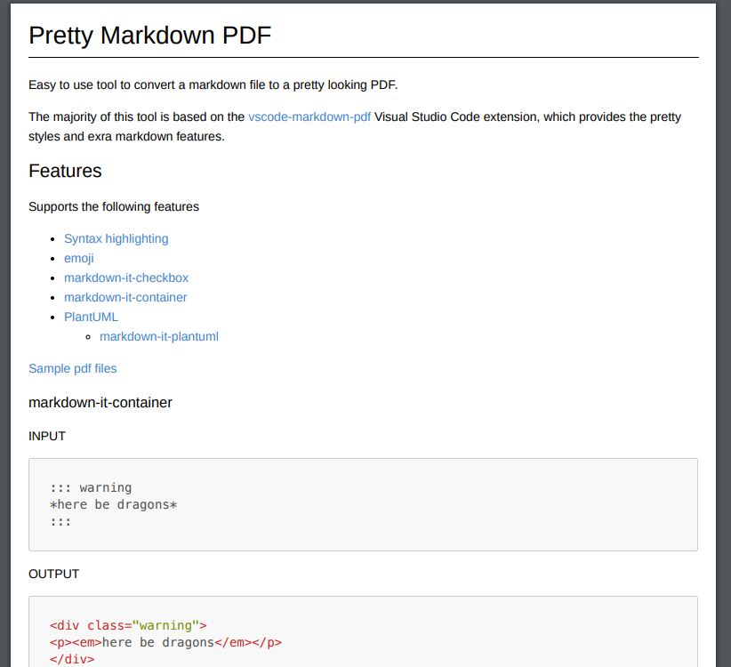

# Pretty Markdown PDF

Easy to use tool to convert a markdown file to a pretty looking PDF.

The majority of the code is based on the [vscode-markdown-pdf](https://github.com/yzane/vscode-markdown-pdf) Visual Studio Code extension, which provides the pretty styles and extra markdown features.



## Features

Supports the following features
* Supports export from MD to PDF, HTML, PNG and JPEG
* [Syntax highlighting](https://highlightjs.org/static/demo/)
* [emoji](http://www.webpagefx.com/tools/emoji-cheat-sheet/)
* [markdown-it-checkbox](https://github.com/mcecot/markdown-it-checkbox)
* [markdown-it-container](https://github.com/markdown-it/markdown-it-container)
* [PlantUML](http://plantuml.com/)
  * [markdown-it-plantuml](https://github.com/gmunguia/markdown-it-plantuml)

* [Sample pdf file](sample/README.pdf)
* [Sample html file](sample/README.html)
* [Sample png file](sample/README.png)
* [Sample jpeg file](sample/README.jpeg)

### markdown-it-container

INPUT
```
::: warning
*here be dragons*
:::
```

OUTPUT
``` html
<div class="warning">
<p><em>here be dragons</em></p>
</div>
```

### markdown-it-plantuml

INPUT
```
@startuml
Bob -[#red]> Alice : hello
Alice -[#0000FF]->Bob : ok
@enduml
```

OUTPUT


## Usage

Install this project from the NPM package repository:

```bash
npm install -g pretty-markdown-pdf
```

### Command Line

To convert a markdown file to PDF, simply run:

```bash
pretty-md-pdf -i my-doc.md
```

*Run with `--help` to see all the options available.*

This will output a file `my-doc.pdf` in the directory where `my-doc.md` resides.

To specify an output path as `my-exported-doc.pdf`, run:

```bash
pretty-md-pdf -i my-doc.md -o my-exported-doc.pdf
```

#### Other Export Types

To specify an output type other than PDF, run:

```bash
pretty-md-pdf -i my-doc.md -t png
```

### Javascript

You can programmatically call this package, example:

```javascript
const prettyMdPdf = require("pretty-markdown-pdf")

// output to `my-doc.pdf`
prettyMdPdf.convertMd({ markdownFilePath: "my-doc.md" })

// specify an output file path
prettyMdPdf.convertMd({ markdownFilePath: "my-doc.md", outputFilePath: "output.pdf" })

// specify an output file type, outputs to `my-doc.html`
prettyMdPdf.convertMd({ markdownFilePath: "my-doc.md", outputFileType: "html" })

```

## Configuration

Advanced configuration is done using a JSON file. By default the tools uses the one shipped with this package, which has defaults set.

To specify a config file when running the tool:

```
pretty-md-pdf -i my-doc.md -c /tmp/config.json
```

From JavaScript you can do:

```javascript
prettyMdPdf.convertMd({ markdownFilePath: "my-doc.md", configFilePath: "/tmp/config.json")
```

### Example

Below is the default config JSON file as an example:

```json
{
    "type": [
        "pdf"
    ],
    "outputDirectory": "",
    "outputDirectoryRelativePathFile": false,
    "styles": [],
    "stylesRelativePathFile": false,
    "includeDefaultStyles": true,
    "highlight": true,
    "highlightStyle": "",
    "breaks": false,
    "emoji": true,
    "markdown-it-include": true,
    "executablePath": "",
    "scale": 1,
    "displayHeaderFooter": true,
    "headerTemplate": "<div style=\"font-size: 9px; margin-left: 1cm;\"> <span class='title'></span></div> <div style=\"font-size: 9px; margin-left: auto; margin-right: 1cm; \"> <span class='date'></span></div>",
    "footerTemplate": "<div style=\"font-size: 9px; margin: 0 auto;\"> <span class='pageNumber'></span> / <span class='totalPages'></span></div>",
    "printBackground": true,
    "orientation": "portrait",
    "pageRanges": "",
    "format": "A4",
    "width": "",
    "height": "",
    "margin": "1cm",
    "quality": 100,
    "clip": {
        "height": null
    },
    "omitBackground": false
}
```

### Options

|Category| Option name|
|:---|:---|
|[Save options](#save-options)|[type](#pretty-pdf-type)|
||[outputDirectory](#pretty-pdf-outputdirectory)|
||[outputDirectoryRelativePathFile](#pretty-pdf-outputdirectoryrelativepathfile)|
|[Styles options](#styles-options)|[styles](#pretty-pdf-styles)|
||[stylesRelativePathFile](#pretty-pdf-stylesrelativepathfile)|
||[includeDefaultStyles](#pretty-pdf-includedefaultstyles)|
|[Syntax highlight options](#syntax-highlight-options)|[highlight](#pretty-pdf-highlight)|
||[highlightStyle](#pretty-pdf-highlightstyle)|
|[Markdown options](#markdown-options)|[breaks](#pretty-pdf-breaks)|
|[Emoji options](#emoji-options)|[emoji](#pretty-pdf-emoji)|
|[Configuration options](#configuration-options)|[executablePath](#pretty-pdf-executablepath)|
|[Common Options](#common-options)|[scale](#pretty-pdf-scale)|
|[PDF options](#pdf-options)|[displayHeaderFooter](#pretty-pdf-displayheaderfooter)|
||[headerTemplate](#pretty-pdf-headertemplate)|
||[footerTemplate](#pretty-pdf-footertemplate)|
||[printBackground](#pretty-pdf-printbackground)|
||[orientation](#pretty-pdf-orientation)|
||[pageRanges](#pretty-pdf-pageranges)|
||[format](#pretty-pdf-format)|
||[width](#pretty-pdf-width)|
||[height](#pretty-pdf-height)|
||[margin.top](#pretty-pdf-margintop)|
||[margin.bottom](#pretty-pdf-marginbottom)|
||[margin.right](#pretty-pdf-marginright)|
||[margin.left](#pretty-pdf-marginleft)|
|[PNG JPEG options](#png-jpeg-options)|[quality](#pretty-pdf-quality)|
||[clip.x](#pretty-pdf-clipx)|
||[clip.y](#pretty-pdf-clipy)|
||[clip.width](#pretty-pdf-clipwidth)|
||[clip.height](#pretty-pdf-clipheight)|
||[omitBackground](#pretty-pdf-omitbackground)|

<a id="save-options"/>

### Save options

<a id="pretty-pdf-type"/>

#### `type`
  - Output format: pdf, html, png, jpeg
  - Multiple output formats supported
  - Default: pdf

```javascript
"type": [
  "pdf",
  "html",
  "png",
  "jpeg"
],
```
<a id="pretty-pdf-outputdirectory"/>

#### `outputDirectory`
  - Output Directory
  - All `\` need to be written as `\\` (Windows)

```javascript
"outputDirectory": "C:\\work\\output",
```

*Relative Paths*

```javascript
"outputDirectory": "~/output",
```

  - If you set a directory with a `relative path`, it will be created if the directory does not exist
  - If you set a directory with an `absolute path`, an error occurs if the directory does not exist

<a id="pretty-pdf-outputDirectoryRelativePathFile"/>

#### `outputDirectoryRelativePathFile`
  - If `outputDirectoryRelativePathFile` option is set to `true`, the relative path set with [outputDirectory](#pretty-pdf-outputDirectory) is interpreted as relative from the file
  - boolean. Default: false

<a id="styles-options"/>

### Styles options

<a id="pretty-pdf-styles"/>

#### `styles`
  - A list of local paths to the stylesheets to use from pretty-markdown-pdf
  - If the file does not exist, it will be skipped
  - All `\` need to be written as `\\` (Windows)

```javascript
"styles": [
  "C:\\Users\\<USERNAME>\\Documents\\css",
  "/home/<USERNAME>/settings/css",
],
```

```javascript
"styles": [
  "css",
],
```

```javascript
"styles": [
  "~/.config/Code/User/css"
],
```

  - Remote CSS (https://xxx/xxx.css) is applied correctly for JPG and PNG, but problems occur with PDF

```javascript
"styles": [
  "https://xxx/css"
],
```

<a id="pretty-pdf-stylesRelativePathFile"/>

#### `stylesRelativePathFile`

  - If `stylesRelativePathFile` option is set to `true`, the relative path set with [styles](#pretty-pdf-styles) is interpreted as relative from the file
  - boolean. Default: false

<a id="pretty-pdf-includeDefaultStyles"/>

#### `includeDefaultStyles`
  - Enable the inclusion of default Markdown styles
  - boolean. Default: true

<a id="syntax-highlight-options"/>

### Syntax highlight options

<a id="pretty-pdf-highlight"/>

#### `highlight`
  - Enable Syntax highlighting
  - boolean. Default: true

<a id="pretty-pdf-highlightStyle"/>

#### `highlightStyle`
  - Set the style name, this is a builtin Highlight JS css file without the file extension. For example: `github`, `monokai`... Default: `github`
  - [style list](https://github.com/isagalaev/highlight.js/tree/master/src/styles)
  - demo site : https://highlightjs.org/static/demo/

```javascript
"highlightStyle": "github",
```

*Note: You can specify a path to a css file here, ensure your path ends with `.css`*

```javascript
"highlightStyle": "styles/custom.css",
```

<a id="markdown-options"/>

### Markdown options

<a id="pretty-pdf-breaks"/>

#### `breaks`
  - Enable line breaks
  - boolean. Default: false

<a id="emoji-options"/>

### Emoji options

<a id="pretty-pdf-emoji"/>

#### `emoji`
  - Enable emoji. [EMOJI CHEAT SHEET](https://www.webpagefx.com/tools/emoji-cheat-sheet/)
  - boolean. Default: true

<a id="configuration-options"/>

### Configuration options

<a id="pretty-pdf-executablePath"/>

#### `executablePath`
  - Path to a Chromium or Chrome executable to run instead of the bundled Chromium
  - All `\` need to be written as `\\` (Windows)

```javascript
"executablePath": "C:\\Program Files (x86)\\Google\\Chrome\\Application\\chrome.exe"
```

<a id="common-options"/>

### Common Options

<a id="pretty-pdf-scale"/>

#### `scale`
  - Scale of the page rendering
  - number. default: 1

```javascript
"scale": 1
```

<a id="pdf-options"/>

### PDF options

  - pdf only. [puppeteer page.pdf options](https://github.com/GoogleChrome/puppeteer/blob/master/docs/api.md#pagepdfoptions)

<a id="pretty-pdf-displayHeaderFooter"/>

#### `displayHeaderFooter`
  - Enable display header and footer
  - boolean. Default: true

<a id="pretty-pdf-headerTemplate"/>
<a id="pretty-pdf-footerTemplate"/>

#### `headerTemplate`
#### `footerTemplate`
  - HTML template for the print header and footer
  - `<span class='date'></span>` : formatted print date
  - `<span class='title'></span>` : markdown file name
  - `<span class='url'></span>` : markdown full path name
  - `<span class='pageNumber'></span>` : current page number
  - `<span class='totalPages'></span>` : total pages in the document

```javascript
"headerTemplate": "<div style=\"font-size: 9px; margin-left: 1cm;\"> <span class='title'></span></div> <div style=\"font-size: 9px; margin-left: auto; margin-right: 1cm; \"> <span class='date'></span></div>",
```
```javascript
"footerTemplate": "<div style=\"font-size: 9px; margin: 0 auto;\"> <span class='pageNumber'></span> / <span class='totalPages'></span></div>",
```

<a id="pretty-pdf-printBackground"/>

#### `printBackground`
  - Print background graphics
  - boolean. Default: true

<a id="pretty-pdf-orientation"/>

#### `orientation`
  - Paper orientation
  - portrait or landscape
  - Default: portrait

<a id="pretty-pdf-pageRanges"/>

#### `pageRanges`
  - Paper ranges to print, e.g., '1-5, 8, 11-13'
  - Default: all pages

```javascript
"pageRanges": "1,4-",
```

<a id="pretty-pdf-format"/>

#### `format`
  - Paper format
  - Letter, Legal, Tabloid, Ledger, A0, A1, A2, A3, A4, A5, A6
  - Default: A4

```javascript
"format": "A4",
```

<a id="pretty-pdf-width"/>
<a id="pretty-pdf-height"/>

#### `width`
#### `height`
  - Paper width / height, accepts values labeled with units(mm, cm, in, px)
  - If it is set, it overrides the format option

```javascript
"width": "10cm",
"height": "20cm",
```

<a id="pretty-pdf-margintop"/>
<a id="pretty-pdf-marginbottom"/>
<a id="pretty-pdf-marginright"/>
<a id="pretty-pdf-marginleft"/>

#### `margin.top`
#### `margin.bottom`
#### `margin.right`
#### `margin.left`
  - Paper margins.units(mm, cm, in, px)

```javascript
"margin.top": "1.5cm",
"margin.bottom": "1cm",
"margin.right": "1cm",
"margin.left": "1cm",
```

<a id="jpeg-options"/>

### PNG JPEG options

  - png and jpeg only. [puppeteer page.screenshot options](https://github.com/GoogleChrome/puppeteer/blob/master/docs/api.md#pagescreenshotoptions)

<a id="pretty-pdf-quality"/>

#### `quality`
  - jpeg only. The quality of the image, between 0-100. Not applicable to png images

```javascript
"quality": 100,
```

<a id="pretty-pdf-clipx"/>
<a id="pretty-pdf-clipy"/>
<a id="pretty-pdf-clipwidth"/>
<a id="pretty-pdf-clipheight"/>

#### `clip.x`
#### `clip.y`
#### `clip.width`
#### `clip.height`
  - An object which specifies clipping region of the page
  - number

```javascript
//  x-coordinate of top-left corner of clip area
"clip.x": 0,

// y-coordinate of top-left corner of clip area
"clip.y": 0,

// width of clipping area
"clip.width": 1000,

// height of clipping area
"clip.height": 1000,
```

<a id="pretty-pdf-omitBackground"/>

#### `omitBackground`
  - Hides default white background and allows capturing screenshots with transparency
  - boolean. Default: false

## FAQ

### How can I change emoji size ?

1. Add the following to your stylesheet, which you can specified in the styles field

```css
.emoji {
  height: 2em;
}
```

### Output directory

If you want to always output to a directory path relative from the Markdown file.

For example, to output to the "output" directory in the same directory as the Markdown file, set it as follows.

```javascript
"outputDirectory" : "output",
"outputDirectoryRelativePathFile": true,
```

### Page Break

Please use the following to insert a page break.

``` html
<div class="page"/>
```

## Note on Chromium

Chromium download starts automatically before the first conversion; this is a one time operation, only if your reinstall this package will it be downloaded again.

This is a time-consuming task depending on the environment because of its large size (~ 170Mb Mac, ~ 282Mb Linux, ~ 280Mb Win).

During the Chromuim download, the message `Installing Chromium` will be displayed in the console.
